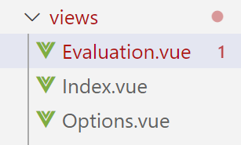
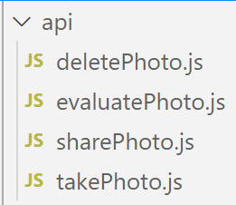

# Evaluator

## Description

​		拍摄照片对图中烟雾浓度进行测定的APP。[详情见](https://github.com/LimboDzz/Evaluator/blob/master/%E8%AF%BE%E8%AE%BE%E8%A6%81%E6%B1%82-%E9%BB%91%E5%BA%A6.docx)

## Skill Stack
- Vue/Vuex/VueRouter
- Capacitor
- Ionic
- Android Studio（代码调试及最终apk导出）

## Implementation

### View

​		使用Ionic脚手架生成了一个具有三个Tab页的基础项目框架，针对项目第一大拍摄照片需求，将其中一个Tab用作相册展示区域并在屏幕下方添加拍摄按钮，其他两个Tab保留原始页面架构和路由信息的基础上更改为弹出选项框和烟雾浓度结果展示页面。

​		页面样式和切换主要通过Vue、VueRouter和Ionic组件库搭建。

​		其中样式部分选择Ionic而没有选择其他UI库是因为Capacitor基本上与Ionic捆绑使用（同一家公司的产品+官方推荐），而我本此项目最终结果呈现需要Android APK，像拍摄分享等安卓手机的原生功能如果不使用Android SDK编写的话，需要Capacitor这样的手机平台runtime，他把安卓平台特定的功能再次打包封装成WEB开发者可以通过Javascript调用的插件。

### Model

​		Vue框架本身就是对MVC的一种实现，所以一开始对数据的操作直接用了Vue的Data，但是也因此被Vue自带的数据处理方面的劣势限制住，比如说父子组件之间的数据传递非常麻烦，而且默认是单向传递，如果要实现子组件数据变化父组件自改变需要写很多重复的代码。因此后来又去了解并使用了Vuex，是Vue团队推出的专门用于项目内数据共享的方法，有点全局变量的意味在里面，如果多个组件同时对一部分数据产生影响，那么把这些数据同一放在store（一般是单个的js文件）。

### Controller

​		同样使用了Vue框架的实现，但把各个功能单独提取到js文件做了一个微小的模块化处理。其中：

- 拍照
  - 直接调用@capacitor/camera，可以在options中指定拍照参数，拍摄结束把照片信息返回并插入在store中的imgs数组。
- 删除
  - 将选中的img从store中保存的imgs数组里删除。
- 分享
  - 调用了@capacitor/share和@capacitor/geolocation，想要在分享的时候加入当前位置信息。
- 烟雾浓度判定
  - 导入了“image-js”这个图像处理库，对选中的img的webPath信息做一步转化，转化成库中的Image类型，再对该图片对象灰度化处理，提取像素总数和颜色总数求出平均值，得到图像大体上的灰度百分比作为格林曼灰度测定结果。

## Obstacles

- **照片读写：**之前提到软件内我使用vuex来保存信息，如果只是网页端的话这样数据处理基本上没有问题了，但由于最终app需要能够在安卓上进行照片存储和访问，需要额外在软件外进行文件读写操作，但由于Capacitor的官方文档对于文件操作这块的api介绍比较简略没有示例代码，我自己使用该api没有办法在网页端进行调试（需要安卓环境才能检测效果）等等诸多原因没有实现在安卓端的照片读写。

- **代码调试：**90%的时间都是在用网页开发者工具中的响应式视图中对代码开发结果进行观测，但其实很多安卓原生功能即使代码成功实现了但是网页中也无法展示，在我没有意识到这一点之前花费了很多时间在没有必要的代码修改上，而且即使在后续Capacitor的文档阅读中获悉了这一点，也还是导致开发时间成倍增长，因为网页上某个功能没有出效果我必须再用安卓模拟器跑一遍才能知道我的代码逻辑有没有写对。Ionic-cli虽然官方问档给出了直接跑通android的命令但是我多次实验没有效果。

## Conclusions

​		很多时候最好使用平台推荐的开发方式去完成特定平台的应用。

​		我一开始直接排除掉了使用Android Studio开发，主要是想规避自己重新去学Kotlin或者Java以及相应的框架，但其实使用跨平台的开发方式没有想象中的方便，比喻来说就好像本来一部车能到的地方我偏偏选择地铁9号线转轻轨再换11路，如果之后有类似安卓平台的开发需求我会去尝试Kotlin。